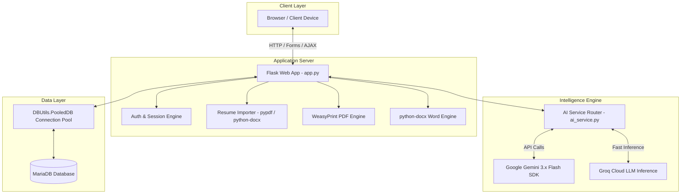

# 📄 ResumeAI — Intelligent Career Suite & AI Resume Generator 🚀

<p align="center">
  <strong>An enterprise-grade, full-stack AI Resume Builder, ATS Optimization Engine, Cover Letter Generator, STAR Interview Preparation Kit, and Job Application CRM powered by Python, Flask, MariaDB, Google Gemini, and Groq.</strong>
</p>

<p align="center">
  <a href="https://github.com/ShriyashBPatil/resume-builder/stargazers"></a>
  <a href="https://github.com/ShriyashBPatil/resume-builder/network/members"></a>
  
  
  
  
  
  
  
</p>

---

## 📑 Table of Contents

- [Overview](#-overview)
- [System Architecture](#-system-architecture)
- [Complete Feature Deep Dive](#-complete-feature-deep-dive)
  - [1. User Management & Data Isolation](#1-user-management--data-isolation)
  - [2. Master Profile Inventory & Smart Resume Parser](#2-master-profile-inventory--smart-resume-parser)
  - [3. Dual AI LLM Engine (Gemini & Groq)](#3-dual-ai-llm-engine-gemini--groq)
  - [4. JD Tailoring & Google X-Y-Z ATS Optimizer](#4-jd-tailoring--google-x-y-z-ats-optimizer)
  - [5. AI Cover Letter Generator](#5-ai-cover-letter-generator)
  - [6. STAR Framework Interview Preparation Kit](#6-star-framework-interview-preparation-kit)
  - [7. In-Line AI Bullet Re-Writer & Analytics](#7-in-line-ai-bullet-re-writer--analytics)
  - [8. Multi-Template PDF & Multi-Format Exports](#8-multi-template-pdf--multi-format-exports)
  - [9. Job Application Kanban Pipeline (CRM)](#9-job-application-kanban-pipeline-crm)
  - [10. Public Portfolios & QR Codes](#10-public-portfolios--qr-codes)
  - [11. Admin Control Plane](#11-admin-control-plane)
- [Database Schema & Architecture](#-database-schema--architecture)
- [Directory Structure](#-directory-structure)
- [Installation & Setup](#-installation--setup)
- [Environment Configuration](#-environment-configuration)
- [Testing & Quality Assurance](#-testing--quality-assurance)
- [Production Deployment](#-production-deployment)
- [Author & License](#-author--license)

---

## 🌟 Overview

Getting noticed by Applicant Tracking Systems (ATS) and hiring managers requires tailored resumes, persuasive cover letters, and targeted interview preparation for every single job opening. Manually customizing documents is time-consuming and prone to formatting errors.

**ResumeAI** solves this end-to-end. By combining the conversational intelligence of **Google Gemini 3.x** and the ultra-low latency inference of **Groq Cloud**, ResumeAI automatically parses your raw career history, aligns your accomplishments against target job requirements using Google's proven **X-Y-Z formula**, generates custom cover letters and STAR interview kits, and exports pixel-perfect PDF/DOCX files formatted to pass ATS parsers cleanly.

---

## 🏗 System Architecture



---

## 🚀 Complete Feature Deep Dive

### 1. User Management & Data Isolation
- **Authentication & Security**: User registration, login with `werkzeug.security` SHA-256 password hashing, and secure session cookies.
- **Forgot & Reset Password Workflow**: Email-based time-limited reset tokens stored securely in `password_resets`.
- **Granular Multi-Tenancy**: Every profile, tailored resume, cover letter, and job application is strictly scoped to the logged-in user's database ID.

### 2. Master Profile Inventory & Smart Resume Parser
- **Single Source of Truth**: Maintain your master inventory of contact info, GitHub/LinkedIn links, portfolio URLs, work history, education, skills by categories, projects, and certifications.
- **AI Document Ingestion**: Upload existing resumes in `.pdf`, `.docx`, or `.txt` format. The system extracts raw text and uses AI to automatically parse and populate your Master Profile.
- **One-Click Demo Profile**: Quickly populate sample developer profiles for testing.

### 3. Dual AI LLM Engine (Gemini & Groq)
- **Google Gemini**: Integrates Gemini 3.6 Flash, Gemini 3.7 Flash, and Gemini 3.5 Flash for nuanced, creative writing and deep ATS keyword matching.
- **Groq Cloud**: Lightning-fast inference with `openai/gpt-oss-20b` and Llama models.
- **Key Management**: Users can supply their personal API keys (BYOK) or leverage administrator-configured server-wide keys.

### 4. JD Tailoring & Google X-Y-Z ATS Optimizer
- Paste any target Job Description (JD).
- ResumeAI analyzes required technical competencies, soft skills, and domain keywords.
- Reformats accomplishments using the Google standard:
  $$\text{Accomplished } [X] \text{ as measured by } [Y] \text{ by doing } [Z]$$
- Generates an **ATS Match Score (0–100%)**, matched keyword badges, missing skills checklist, and strategic recommendations.

### 5. AI Cover Letter Generator
- Instantly creates tailored, professional cover letters matching the candidate's achievements to the company's mission.
- **4 Selectable Tones**:
  1. *Professional & Persuasive*: High-impact and results-oriented.
  2. *Modern & Engaging*: Conversational and culturally dynamic.
  3. *Executive & Strategic*: Leadership-focused with vision.
  4. *Concise & Direct*: Crisp 3-paragraph format.
- Direct export to **PDF** and **Microsoft Word (.docx)**.

### 6. STAR Framework Interview Preparation Kit
- **60-Second Elevator Pitch**: Tailored "Tell me about yourself" response connecting past experiences to the target role.
- **Technical & Architectural Probes**: High-probability technical interview questions with recommended talking points.
- **Behavioral Questions with STAR Mapping**:
  - **S**ituation: Background and context.
  - **T**ask: The challenge or objective.
  - **A**ction: Specific technical and leadership steps taken.
  - **R**esult: Quantified outcomes and business value.
- **Questions for the Interviewer**: Strategic questions to ask the hiring team.

### 7. In-Line AI Bullet Re-Writer & Analytics
- **Live Bullet Optimizer**: Select any bullet point and rewrite it with one click:
  - *Google X-Y-Z*
  - *Add Metrics & Percentages*
  - *Power Action Verbs*
  - *Punchy 1-Liner*
  - *Executive Leadership Tone*
- **Readability & ATS Linter**:
  - Word count analyzer per bullet.
  - Corporate cliché and weak buzzword flagger (*"hard worker"*, *"synergy"*, *"team player"*).
  - Passive voice detector with active voice conversion suggestions.

### 8. Multi-Template PDF & Multi-Format Exports
- **WeasyPrint PDF Engine**: Pixel-perfect vector rendering matching ATS single-column and dual-column layouts.
- **4 Unique Resume Templates**:
  - *Modern Blue*: Clean ATS-optimized layout with modern typography.
  - *Executive Serif*: Sophisticated, formal design for management and consulting.
  - *Creative Sidebar*: Two-column visual layout for UI/UX and product design.
  - *Tech Terminal*: Developer & Systems engineer mono-accented theme.
- **1-Page Fit Algorithm**: Automatically scales line-heights and margins to guarantee clean single-page outputs without awkward orphan lines.
- **Custom Accent Color Swatches**: Personalize primary header and border hues dynamically.
- **4 Export Formats**: PDF (`.pdf`), Microsoft Word (`.docx`), Markdown (`.md`), and structured JSON (`.json`).

### 9. Job Application Kanban Pipeline (CRM)
- Interactive visual Kanban board tracking application statuses:
  - 📥 *Saved* ➔ 📤 *Applied* ➔ 💬 *Interviewing* ➔ 🏆 *Offered* ➔ 📁 *Rejected*
- Link specific job applications directly to the custom tailored resume and cover letter versions.

### 10. Public Portfolios & QR Codes
- Shareable public URLs (`/r/<unique_token>`) with toggleable visibility and print views.
- Embedded scannable QR codes rendered directly on PDF exports linking to your live web resume.

### 11. Admin Control Plane
- User administration: View registered users, toggle admin privileges, trigger password resets, and remove accounts.
- Universal system keys configuration with database persistence.
- Live generation queue telemetry.

---

## 🗄 Database Schema & Architecture

The application utilizes MariaDB with connection pooling:

| Table | Purpose | Key Fields |
| :--- | :--- | :--- |
| `users` | User credentials and settings | `id`, `username`, `email`, `password_hash`, `gemini_key`, `groq_key`, `is_admin`, `created_at` |
| `profiles` | Master career inventory | `id`, `user_id`, `full_name`, `email`, `phone`, `location`, `linkedin`, `github`, `portfolio`, `summary`, `experience_json`, `education_json`, `skills_json`, `projects_json`, `certifications_json` |
| `resumes` | Tailored resumes & settings | `id`, `user_id`, `profile_id`, `target_title`, `target_company`, `job_description`, `content_json`, `template_name`, `accent_color`, `ats_score`, `share_token`, `is_public` |
| `cover_letters` | Generated cover letters | `id`, `user_id`, `resume_id`, `company_name`, `job_title`, `tone`, `content`, `created_at` |
| `interview_preps` | STAR Interview Kits | `id`, `user_id`, `resume_id`, `elevator_pitch`, `technical_qa_json`, `star_qa_json`, `interviewer_questions_json` |
| `job_applications` | Kanban Application CRM | `id`, `user_id`, `resume_id`, `company_name`, `job_title`, `status`, `salary_range`, `job_url`, `notes` |
| `password_resets` | Password reset tokens | `id`, `user_id`, `token`, `expires_at`, `used` |
| `system_settings` | Universal system keys | `setting_key`, `setting_value`, `description` |

---

## 📂 Directory Structure

```
resume-builder/
├── app.py                   # Main Flask REST application and route handlers
├── ai_service.py            # Gemini & Groq prompt engineering & generation logic
├── db.py                    # MariaDB connection pooling & schema migrations
├── pdf_service.py           # WeasyPrint PDF renderer, dynamic CSS & QR generation
├── doc_service.py           # python-docx Microsoft Word builder
├── email_service.py         # SMTP password reset email notification service
├── test_suite.py            # Unit and integration test suite
├── requirements.txt         # Pinned Python package dependencies
├── .env.example             # Environment configuration template
├── static/                  # Static styles and interactive JavaScript
│   ├── css/
│   └── js/
└── templates/               # Jinja2 HTML templates
    ├── base.html            # Master layout
    ├── dashboard.html       # User dashboard overview
    ├── profile.html         # Master profile manager & resume parser
    ├── generate.html        # AI tailoring & job description analyzer
    ├── build_manual.html    # Manual resume editor
    ├── resumes_list.html    # Resumes catalog
    ├── edit_resume.html     # Interactive resume editor & bullet optimizer
    ├── view_resume.html     # Resume preview & export portal
    ├── public_resume.html   # Public shareable web portfolio
    ├── applications.html    # Kanban job tracker CRM
    ├── settings.html        # User settings & personal API keys
    ├── admin_dashboard.html # Admin user management & system keys
    ├── login.html           # Login portal
    ├── register.html        # Registration portal
    ├── forgot_password.html # Password reset request
    └── reset_password.html  # Password reset submission
```

---

## 🛠️ Installation & Setup

### 1. Prerequisites
- Python 3.10 or higher
- MariaDB or MySQL 8.0+
- System packages for WeasyPrint:
  ```bash
  sudo apt-get update
  sudo apt-get install -y python3-dev libpango-1.0-0 libcairo2 libgdk-pixbuf-2.0-0 libffi-dev shared-mime-info
  ```

### 2. Clone the Repository
```bash
git clone https://github.com/ShriyashBPatil/resume-builder.git
cd resume-builder
```

### 3. Create & Activate Virtual Environment
```bash
python3 -m venv venv
source venv/bin/activate
pip install --upgrade pip
pip install -r requirements.txt
```

### 4. Configure Environment Variables
```bash
cp .env.example .env
```
Edit `.env` with your database credentials and optional server API keys:
```ini
DB_HOST=127.0.0.1
DB_PORT=3306
DB_USER=root
DB_PASSWORD=your_password
DB_NAME=resume_builder
PORT=9999
SECRET_KEY=generate_a_secure_random_key
GEMINI_API_KEY=your_gemini_api_key
GROQ_API_KEY=your_groq_api_key
```

### 5. Launch the Server
```bash
python3 app.py
```
Open `http://localhost:9999` in your web browser.

---

## 🧪 Testing & Quality Assurance

Run the comprehensive automated test suite:
```bash
python3 test_suite.py
```
The suite verifies user registration, profile CRUD, AI fallbacks, token validation, PDF/DOCX exports, and admin controls.

---

## 🛡️ Production Deployment

### Systemd Service Configuration
Create `/etc/systemd/system/resume-builder.service`:

```ini
[Unit]
Description=ResumeAI Web Application
After=network.target mariadb.service docker.service

[Service]
User=root
WorkingDirectory=/root/resume-builder
ExecStart=/root/resume-builder/venv/bin/python app.py
Restart=always
RestartSec=5
Environment=PYTHONUNBUFFERED=1

[Install]
WantedBy=multi-user.target
```

Enable and start:
```bash
sudo systemctl daemon-reload
sudo systemctl enable resume-builder
sudo systemctl start resume-builder
```

---

## 👨‍💻 Author & License

**SHRIYASH PATIL**
- GitHub: [@ShriyashBPatil](https://github.com/ShriyashBPatil)
- Website: [shriyashpatil.in](https://shriyashpatil.in)

Released under the **MIT License**. Copyright (c) 2026 Shriyash Patil.
